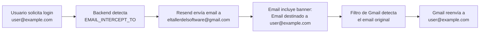

# 📧 Configuración de Emails para Testing

## 🎯 Objetivo

Redirigir todos los emails de la aplicación a un único correo (`eltallerdelsoftware@gmail.com`) para testing, y luego reenviarlos automáticamente al destinatario original usando filtros de Gmail.

---

## 🔧 Paso 1: Configurar Variables de Entorno en Railway

Ve a tu proyecto en Railway y configura estas variables:

```env
# Email desde el cual se envían (dominio de prueba de Resend)
SMTP_FROM_EMAIL=onboarding@resend.dev
SMTP_FROM_NAME=Astillero La Roca

# Email de intercepción (todos los emails se enviarán aquí)
EMAIL_INTERCEPT_TO=eltallerdelsoftware@gmail.com

# Token de Resend (ya lo tienes configurado)
RESEND_TOKEN=re_CqJscpe3_7dghCoGU87GY6FqAuMCLX4A6
```

### ✅ Variables importantes:

- **`SMTP_FROM_EMAIL`**: `onboarding@resend.dev` (dominio de prueba de Resend)
- **`EMAIL_INTERCEPT_TO`**: `eltallerdelsoftware@gmail.com` (todos los emails van aquí)

---

## 📬 Paso 2: Configurar Filtro de Reenvío en Gmail

### Opción A: Filtro con Reenvío Automático

1. **Abre Gmail** (`eltallerdelsoftware@gmail.com`)
2. Ve a **Configuración** (⚙️) → **Ver toda la configuración**
3. Ve a la pestaña **"Filtros y direcciones bloqueadas"**
4. Clic en **"Crear un filtro nuevo"**
5. En "**Incluye las palabras**", escribe:
   ```
   MODO TESTING - Email destinado originalmente a
   ```
6. Clic en **"Crear filtro"**
7. **MARCA**: "Aplicar la etiqueta" → Crear etiqueta nueva: `Testing/Astillero`
8. **MARCA**: "Reenviar a..." → Agrega el email del destinatario original
   - ⚠️ **Nota**: Gmail no permite reenvío dinámico basado en contenido
   - **Solución**: Crear múltiples filtros (uno por cada usuario común)

### Opción B: Filtros Específicos por Usuario (RECOMENDADO)

Crea un filtro para cada usuario que quieras probar:

#### Ejemplo: Usuario `daniel.sanchez.ruiz.1991@gmail.com`

1. **Crear filtro**:
   - **Incluye las palabras**: `Email destinado originalmente a: daniel.sanchez.ruiz.1991@gmail.com`
   - **Crear filtro**
   - **Reenviar a**: `daniel.sanchez.ruiz.1991@gmail.com`
   - **Aplicar etiqueta**: `Testing/Daniel`
   - **Marcar como leído** (opcional)

2. **Habilitar reenvío**:
   - Gmail pedirá confirmación al email de destino
   - El destinario debe aceptar el reenvío

#### Ejemplo: Usuario `otro@example.com`

Repite el proceso para cada usuario:
- **Incluye las palabras**: `Email destinado originalmente a: otro@example.com`
- **Reenviar a**: `otro@example.com`
- **Aplicar etiqueta**: `Testing/Otro`

---

## 🧪 Paso 3: Probar el Sistema

1. **Ve a la aplicación**: https://ai4devs-finalproject-production.up.railway.app
2. **Intenta hacer login** con cualquier email (ej: `daniel.sanchez.ruiz.1991@gmail.com`)
3. **El email llegará a**: `eltallerdelsoftware@gmail.com`
4. **Verás un banner naranja** en el email:
   ```
   🧪 MODO TESTING - Email destinado originalmente a: daniel.sanchez.ruiz.1991@gmail.com
   ```
5. **Gmail reenviará automáticamente** el email a `daniel.sanchez.ruiz.1991@gmail.com` (si configuraste el filtro)

---

## 📊 Cómo Funciona



---

## 🔄 Para Producción (Futuro)

Cuando estés listo para producción:

1. **Verifica un dominio** en https://resend.com/domains
2. **Elimina la variable** `EMAIL_INTERCEPT_TO` de Railway
3. **Cambia** `SMTP_FROM_EMAIL` a tu dominio (ej: `noreply@tudominio.com`)
4. Los emails se enviarán directamente a los destinatarios reales

---

## 🐛 Troubleshooting

### Problema: No llegan emails

1. Verifica que `EMAIL_INTERCEPT_TO` esté configurado en Railway
2. Verifica que `SMTP_FROM_EMAIL=onboarding@resend.dev`
3. Revisa los logs de Railway: `[EmailServiceRailway]`

### Problema: Los filtros de Gmail no funcionan

1. Asegúrate de habilitar el reenvío en Gmail (Settings → Forwarding)
2. El destinatario debe confirmar el reenvío
3. Los filtros se aplican DESPUÉS de recibir el email (puede tardar unos segundos)

### Problema: Gmail marca como spam

1. Ve a Gmail → Spam
2. Marca el email como "No es spam"
3. Crea un filtro adicional: "Nunca enviar a spam"

---

## ✅ Resumen de Configuración

| Variable | Valor | Dónde |
|----------|-------|-------|
| `SMTP_FROM_EMAIL` | `onboarding@resend.dev` | Railway |
| `SMTP_FROM_NAME` | `Astillero La Roca` | Railway |
| `EMAIL_INTERCEPT_TO` | `eltallerdelsoftware@gmail.com` | Railway |
| **Filtros Gmail** | Por cada usuario | Gmail Settings |

---

## 💡 Tip: Usar Labels en Gmail

Crea etiquetas en Gmail para organizar los emails de testing:

- `Testing/Astillero` → Todos los emails del proyecto
- `Testing/Daniel` → Emails para daniel@...
- `Testing/Otros` → Emails para otros usuarios

Esto te ayudará a identificar rápidamente los emails interceptados.
