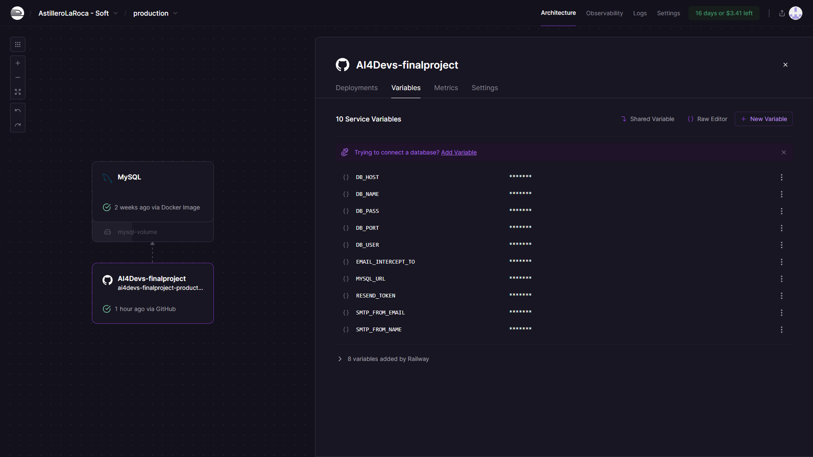
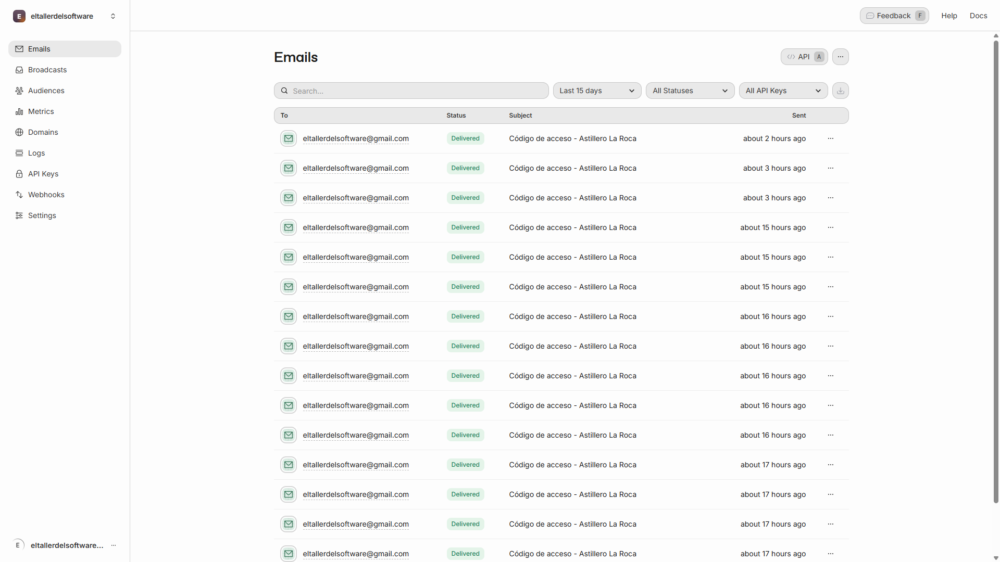

> Detalla en esta sección los prompts principales utilizados durante la creación del proyecto, que justifiquen el uso de asistentes de código en todas las fases del ciclo de vida del desarrollo. Esperamos un máximo de 3 por sección, principalmente los de creación inicial o  los de corrección o adición de funcionalidades que consideres más relevantes.
Puedes añadir adicionalmente la conversación completa como link o archivo adjunto si así lo consideras


## Índice

1. [Descripción general del producto](#1-descripción-general-del-producto)
2. [Arquitectura del sistema](#2-arquitectura-del-sistema)
3. [Modelo de datos](#3-modelo-de-datos)
4. [Especificación de la API](#4-especificación-de-la-api)
5. [Historias de usuario](#5-historias-de-usuario)
6. [Tickets de trabajo](#6-tickets-de-trabajo)
7. [Pull requests](#7-pull-requests)

---

## 1. Descripción general del producto

**Prompt 1:** Creación del contexto inicial del proyecto
Necesito un archivo contexto.md que estructure el siguiente proyecto para que un agente de IA sepa llevar a cabo el desarrollo de principio a FIN y se apoye en este contexto para desarrollarlo.

El proyecto es crear una aplicación web que debe desarrollarse en lenguaje HTML, CSS (TailwindCSS desde CDN), JavaScript Puro, PHP 8.2 puro y MySQL. 

La aplicación web es un `sistema` para un Astillero que quiere controlar y gestionar el stock de sus herramientas portátiles.
Únicamente de sus herramientas portátiles. Los objetivos principales de la aplicación es conocer donde está ubicada la herramienta y que operario la está usando.

La aplicación web debe tener las siguientes funcionalidades.

1. Una pantalla con 3 botones que realicen las siguientes acciones:
1.1. Botón para que un operario utilice una herramienta portátil e indique donde la va a utilizar y de que fecha a que fecha.
	1.1.1. Formulario: Desplegable con herramienta a utilizar, ubicación donde la va a utilizar y fechas en las que la va necesitar.
1.2. Botón para que un operario deje de utilizar una herramienta portátil e indique donde la está dejando, a libre disposición para que otro operario la coja.
	1.2.1. Formulario: Desplegable con herramienta a dejar, ubicación donde la va a dejar.
1.3. Botón para saber donde está una herramienta portátil.
	1.3.1. Formulario: Desplegable con la herramienta que se quiere saber donde está.

2. Una pantalla con 2 botones para visualizar la siguiente información:
2.1. Un Dashboard donde se vea cada herramienta portátil, donde está ubicada, y si la tiene algún operario, quien la tiene y la fecha de inicio de uso y final de uso.
2.2. Un listado de usos de la herramienta, el histórico de usos, quien la ha usado, donde y cuando (de que fecha a que fecha).


Explicación funcional del flujo interno de cada botón de acción:
1. Botón '1.1.', uso de herramienta. 
1.1. Revisar si la herramienta está en uso. Si está en uso decir que no se puede coger porque la está utilizando el operario {nombre_operario} en {nombre_ubicacion}.
1.2. Si está accesible buscar el último registro de esta herramienta y poner en el campo de fecha final, la fecha y hora en que se coge la herramienta.
1.3. Crear un nuevo registro donde se indique el operario, la ubicación y las fechas en las que se va a usar.

2. Botón '1.2.', dejar herramienta.
1.1. Buscar el registro y actualizar el campo de fecha final con la fecha y hora actual, en la que se deja la herramienta.
1.2. Crear un nuevo registro donde se indique ubicación y el campo fecha inicial con la fecha y hora actual.

3. Botón '1.3.', ubicación herramienta.
3.1. Buscar el último registro de la herramienta y mostrar por pantalla, donde está y, si estuviera cogida, quien la tieney las fechas en las que la necesita.

Explicación funcional del flujo interno de cada botón de visualización:
1. Botón '2.1.' Estado Herramientas.
1.1. Cada herramienta tendrá un template que se deberá de rellenar con la información de Ubicación, y si la tiene algún operario; el operario, fecha inicio y fecha fin.
1.2. Cada template tendrá un fondo verde pastel si la herramienta está libre y tendrá un fondo rojo pastel si la herramienta la está usando un operario.
1.3. Esta ventana tendrá un autorefresh cada 5 min y en la parte inferior derecha de la ventana se verá la fecha y hora del último refresco, cogiendo esta fecha y hora del dispositivo que está usando la aplicación, NO del servidor.

Aquí amplio un poco más en detalle técnicamente el BackEnd:
1. Todas las consultas a SQL NO serán directas, irán a través de una API, que también hay que desarrollar.
2. Se creará un login que funcione de la siguiente manera:
	2.1. Se indicará usuario (email del operario) y se comprobará que existe en la base de datos.
		2.1.1. Si existe se enviará un código alfanumérico de 8 dígitos al email.
		2.1.2. Si no existe se indicará que el usuario no está registrado en el sistema.
	2.2. Se abrirá una pantalla donde ingresar el código recibido por email.
		2.2.1. Si el código es correcto se iniciará sesión con un parámetro de inactividad de 24 horas.
		2.2.2. Si el código es incorrecto se volverá a la pantalla del login.
2. En cada botón de acción habrá un desplegable indicar que herramienta portátil y el operario se cogerá de la sesión.
3. Se deben crear las tablas SQL y guardarlas en un script para que al iniciar el proyecto, revise si existen las tablas en la base de datos configurada y sino que las cree.
4. Las tablas maestras de SQL deberán tener un campo boolean llamado activo para activar o desactivar ubicaciones, usuarios/operarios y herramientas.


Ideas extras:
- El login en caso de inactividad por más de 24 horas, tendrás que logarte otra vez.
- La aplicación Web debe ser responsive.
- Quiero que el código sea limpio y con una estructura de directorios escalable y funcional: carpetas src y subcarpetas config, controllers, dto, interfaces, middlewares, routes, services, utils, api y test. Aunque no se utilicen algunas carpetas, quiero crear la estructura ya para que sea escalable y cada funcionalidad esté correctamente definida. También quiero una carpeta docs con un archivo contexto.md para que el agente de IA lea siempre esta carpeta docs antes de realizar cualquier acción.


Recuerda, necesito un archivo contexto.md que estructure el siguiente proyecto para que un agente de IA sepa llevar a cabo el desarrollo de principio a FIN y se apoye en este contexto para desarrollarlo.

---

## 2. Arquitectura del Sistema

### **2.1. Diagrama de arquitectura:**

**Prompt 1:** Conceptos básicos de la arquitectura a seguir.
La arquitectura sigue el patrón MVC con arquitectura de capas sobre PHP puro, usando Router como API Gateway y servicios desacoplados.

**Prompt 2:** Descripción del flujo general del sistema.
El sistema debe serguir el siguiente flujo: Navegador (HTML/JS) → Router.php → Middlewares (Auth, CSRF, Security) → Endpoints API → Controllers → Services → MySQL Database.

**Prompt 3:** Servicios complementarios para cubrir todas las necesidades del proyecto, no solamente la del desarrollo puro y duro.
A continuación te daré información de que herramientas quiero utilizar y seguidamente la funcionalidad que quiero cubrir con esa herramienta.
- Resend API: envío de códigos de autenticación por email.
- Railway: hosting con MySQL automático y despliegue continuo desde GitHub para las pruebas por terceros.
- Session Management: cookies HTTPOnly con expiración de 24 horas.


### **2.2. Descripción de componentes principales:**

**Prompt 1:** Detalles del Frontend.
El Frontend quiero que sea construido con JavaScript + TailwindCSS desde CDN, gestiona la interfaz responsive y comunicación con API REST.

**Prompt 2:** Detalles del Backend.
El Backend quiero que siga el patrón MVC con Router centralizado, Controllers para lógica HTTP, Services para lógica de negocio y acceso a datos, Middlewares para seguridad.

**Prompt 3:** Detalles de infraestructura.
La Infraestructura será desplegada en Railway con Dockerfile, base de datos MySQL gestionada automáticamente, variables de entorno en Railway Dashboard.


### **2.3. Descripción de alto nivel del proyecto y estructura de ficheros**

**Prompt 1:** Consideraciones para features en el proyecto.
El proyecto sigue una estructura modular y escalable para desarrollo colaborativo con asistentes IA (GitHub Copilot, GPT-4).

**Prompt 2:** Estructura Principal del proyecto
Te adjunto la estructura principal que quiero que siga el proyecto. Te indico la estructura de carpetas y su función principal justo a continuación de la carpeta para que siempre consideres antes de escribir código donde se debe alojar.
```
/AI4Devs-finalproject
├── /public              # Frontend + punto de entrada
│   ├── index.html      # Login
│   ├── dashboard.html  # Dashboard herramientas
│   └── /js             # Módulos JS (api.js, auth.js, dashboard.js, etc)
├── /src
│   ├── /api            # Endpoints REST
│   ├── /controllers    # Lógica de negocio
│   ├── /services       # Acceso a datos y servicios externos
│   ├── /middlewares    # Seguridad y validación
│   └── /utils          # Utilidades (Validator, Logger, etc)
├── /db                 # Scripts SQL (schema.sql, data.sql)
├── /docs               # Documentación técnica
├── Dockerfile          # Deploy en Railway
└── composer.json       # Dependencias PHP
```

**Prompt 3:** Reiteración en la escalabilidad, porque el proyecto que voy a realizar tendrá 5 funcionalidades principales, pero se podrá escalar a más funcionalidades según nuevas necesidades encontradas.
El desarrollo está pensado para escalar fácilmente, permitiendo añadir nuevos endpoints API, servicios de negocio y middlewares sin afectar componentes existentes.


### **2.4. Infraestructura y despliegue**

**Prompt 1:** Despliegue en Railway
El sistema se despliega automáticamente mediante Railway, integrando GitHub como origen de despliegues continuos (CI/CD) en su rama main.

**Prompt 2:** Manera de como queiro desplegar en Railway.
El entorno de producción utiliza Dockerfile con imagen php:8.3-cli, instalando extensiones PDO MySQL y ejecutando Composer install automáticamente.

**Prompt 3:** Detalles de las utilidades utilizadas para que tenga el conocimiento de como lo quiero gestionar.
- Railway MySQL → base de datos gestionada.
- Resend API → envío de emails transaccionales.
- Variables de entorno seguras configuradas en Railway Dashboard (DB_HOST, DB_USER, DB_PASS, RESEND_TOKEN).





### **2.5. Seguridad**

**Prompt 1:** PasswordLess
Se implementa autenticación passwordless con códigos temporales de 8 caracteres alfanuméricos y expiración de 15 minutos, eliminando el riesgo de robo de contraseñas.

**Prompt 2:** Cerrar sesión por Inactividad
Las sesiones utilizan cookies HTTPOnly con SameSite=Strict y Secure flag en producción, con expiración automática tras 24 horas de inactividad.

**Prompt 3:** Otras seguridades a implementar
El proyecto quiero que cumpla e integre la siguientes funcionalidades de seguridad:
- CSRF Protection con tokens únicos por sesión.
- Rate Limiting: máximo 5 intentos de login en 15 minutos.
- Prepared Statements en todas las queries SQL.
- Security Headers (X-Frame-Options, CSP, X-Content-Type-Options).

### **2.6. Tests**

**Prompt 1:** Como vamos a funcionar a la hora de QA / Testing.
No se implementaran tests automatizados durante el desarrollo del MVP. Se realizarán pruebas manuales exhaustivas de todos los flujos: autenticación, usar/dejar herramienta, dashboard y histórico y si encontramos algún problema, se incluirán logs de consola y en Railway para detectar donde se produce el fallo y para que posteriormente con estos logs me ayudes a resolverlos.

---

### 3. Modelo de Datos

**Prompt 1:** Explicación las tablas principales.
El sistema utiliza MySQL 8.0 con 6 tablas principales: usuarios, herramientas, ubicaciones, movimientos_herramienta, codigos_login y login_attempts.

**Prompt 2:** Explicación más importante de la lógica de negocio del MVP de la aplicación.
Tabla central `movimientos_herramienta` registra todo el histórico: si `fecha_fin IS NULL` → herramienta EN USO, si `fecha_fin NOT NULL` → herramienta DISPONIBLE.

**Prompt 3:** Detalles de las relaciones entre la tabla core del sistema y como funcionará el borrado del sistema (no se borra, hay un campo de activo).
Relaciones clave entre la tabla movimientos_herramienta:
- usuarios 1:N movimientos_herramienta
- herramientas 1:N movimientos_herramienta
- ubicaciones 1:N movimientos_herramienta
Todas las tablas maestras incluyen campo `activo` para soft delete.

---

### 4. Especificación de la API

**Prompt 1:** Exponer los 3 módulos principales del MVP.
API REST completa con 3 módulos principales:
- `/api/login/*` → Autenticación passwordless
- `/api/herramientas/*` → CRUD de herramientas (usar, dejar, consultar)
- `/api/dashboard` → Estado en tiempo real de todas las herramientas

**Prompt 2:** Respuestas siempre en JSON.
Todos los endpoints retornan JSON con estructura estándar:
```json
{
  "success": true/false,
  "message": "Mensaje descriptivo",
  "data": {...}
}
```

**Prompt 3:** Requisitos y excepciones principales de los endpoints
La API debe cumplir:
- Todos los endpoints excepto `/api/login/*` requieren sesión activa validada por AuthMiddleware.
- POST/PUT/DELETE requieren token CSRF válido.
- Rate limiting en endpoint de login (5 intentos/15min).

---

### 5. Historias de Usuario

**Prompt 1:** Primera Historía de Usuario.
Como operario, quiero autenticarme sin contraseña usando solo mi email corporativo para acceder rápidamente al sistema desde cualquier dispositivo.

**Prompt 2:** Segunda Historía de Usuario.
Como operario, quiero registrar que voy a usar una herramienta específica indicando ubicación y fecha estimada de devolución, para que mis compañeros sepan que está asignada a mí. Pudiendo no indicar la fecha estimada de devolución.

**Prompt 3:** Tercera Historía de Usuario.
Como supervisor, quiero ver el estado actual de todas las herramientas en un dashboard con actualización automática cada 5 minutos, para localizar rápidamente herramientas disponibles o saber quién está usando cada una.

---

### 6. Tickets de Trabajo

**Prompt 1:** Primer Prompt utilizado para la implementación de ResendAPI
Implementar EmailService con Resend API para envío de códigos de autenticación.
- Instalar SDK de Resend via Composer.
- Crear método `sendVerificationCode()` con template HTML.
- Configurar variables de entorno (RESEND_TOKEN, SMTP_FROM_EMAIL).

**Prompt 2:** Primer Prompt utilizado para la implementación del AuthMiddleware
Implementar AuthMiddleware para validación de sesiones en rutas protegidas.
- Verificar cookie ASTILLERO_SESSION en cada petición.
- Validar contra tabla `sesiones` en MySQL.
- Retornar 401 Unauthorized si sesión inválida o expirada.

**Prompt 3:** Prompt utilizado hacer limpieza del código antes de subirlo a producción y hacer el Pull 
Refactoring: limpieza exhaustiva de código de debugging en producción.
- Eliminar todos los `error_log()` del backend PHP (58 ocurrencias).
- Eliminar todos los `console.log()` del frontend JavaScript (46 ocurrencias).
- Eliminar archivo `debug.js` y comentarios obsoletos.
Cleaning: Haz una revisión exhaustiva de todo el código para hacer limpieza. Revisa archivo a archivo.
Quiero limpiar el código de incoherencias, duplicidades, codigo sin uso, comentarios obsoletos y archivos sin uso.

---

### 7. Pull Requests

**Prompt 1:** Explicame con detalle como hacer un Pull Request y si te falta información preguntame y te iré contestando tus preguntas.

