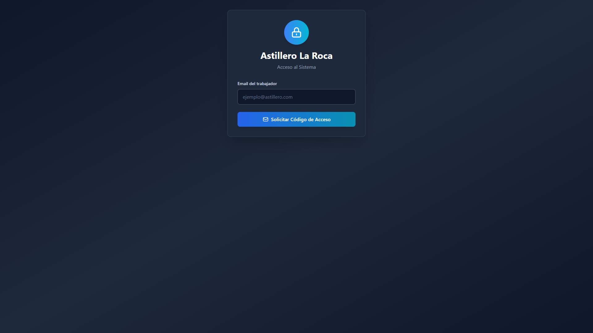
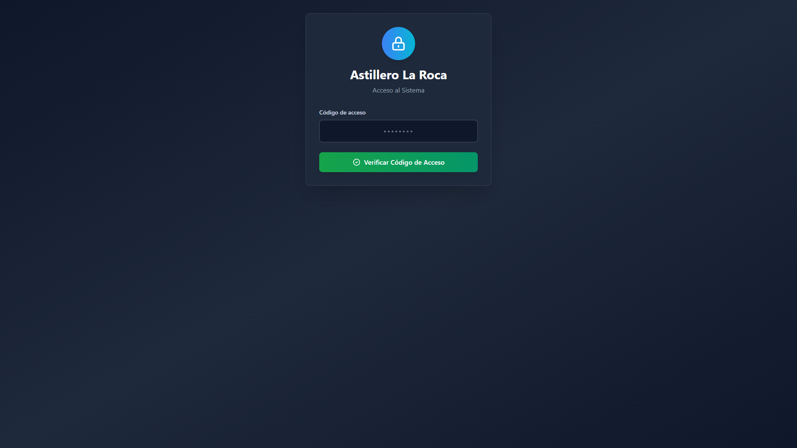
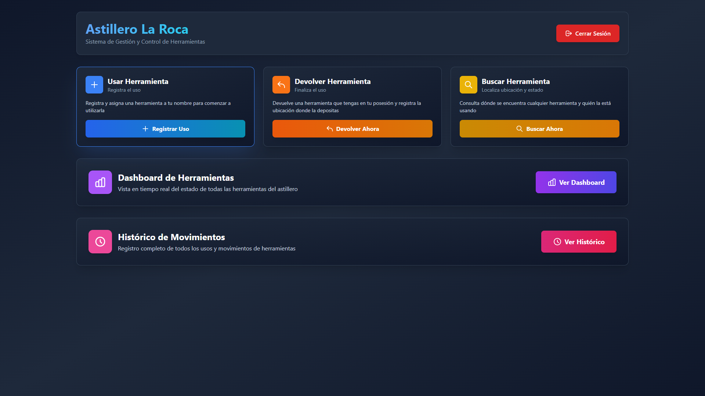
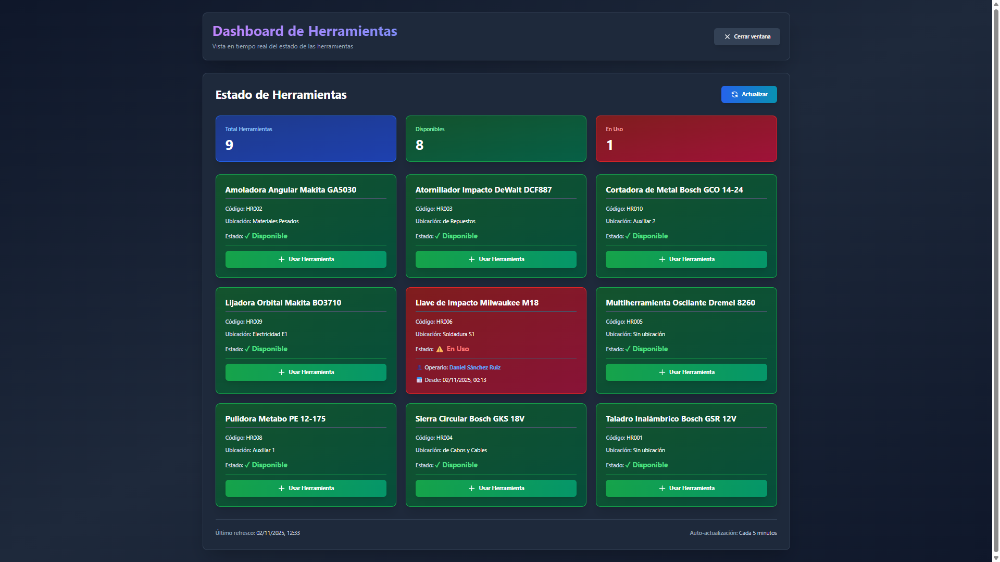
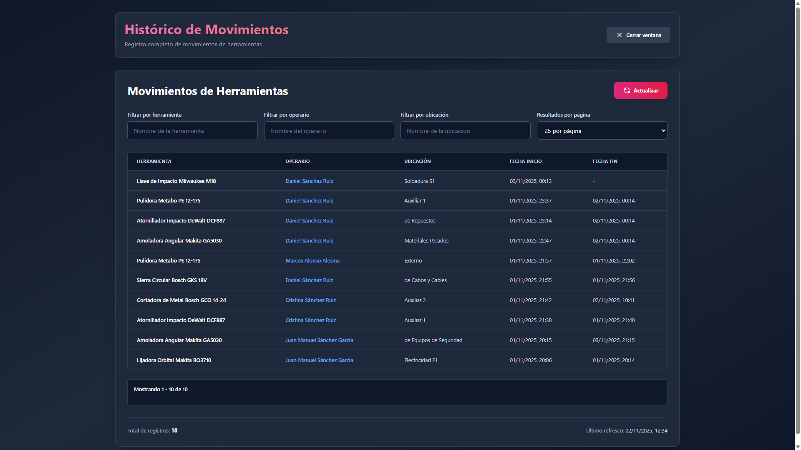
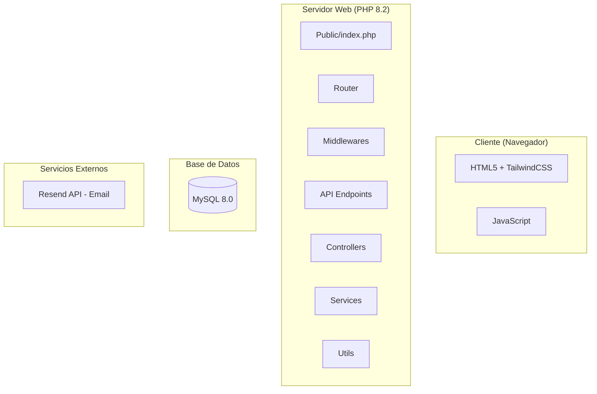
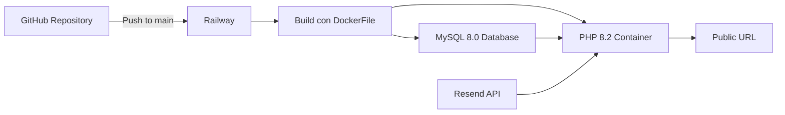
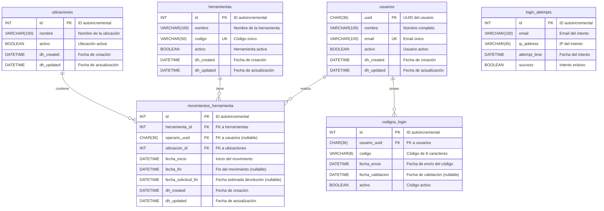

## Índice

0. [Ficha del proyecto](#0-ficha-del-proyecto)
1. [Descripción general del producto](#1-descripción-general-del-producto)
2. [Arquitectura del sistema](#2-arquitectura-del-sistema)
3. [Modelo de datos](#3-modelo-de-datos)
4. [Especificación de la API](#4-especificación-de-la-api)
5. [Historias de usuario](#5-historias-de-usuario)
6. [Tickets de trabajo](#6-tickets-de-trabajo)
7. [Pull requests](#7-pull-requests)

---

## 0. Ficha del proyecto

### **0.1. Tu nombre completo:**
Daniel Sánchez Ruiz

### **0.2. Nombre del proyecto:**
AI4Devs-finalproject - Sistema de Gestión de Herramientas Portátiles para Astillero

### **0.3. Descripción breve del proyecto:**
Aplicación web completa desarrollada con PHP puro y JavaScript para la gestión y control en tiempo real de herramientas portátiles en un astillero. Permite registrar el uso, devolución y consulta de ubicación de herramientas, con un sistema de autenticación por código de acceso enviado por email. El proyecto fue desarrollado íntegramente utilizando IA (GitHub Copilot, GPT-4, Claude) siguiendo las técnicas aprendidas en el Máster de IA.

### **0.4. URL del proyecto:**
https://ai4devs-finalproject-production.up.railway.app/

### 0.5. URL o archivo comprimido del repositorio
https://github.com/Taller-Software/AI4Devs-finalproject

---

## 1. Descripción general del producto

### **1.1. Objetivo:**

El objetivo principal de este sistema es **digitalizar y optimizar el control de herramientas portátiles** en un astillero, resolviendo el problema crítico de no saber dónde está cada herramienta ni quién la está utilizando en cada momento. Además de hacerlo totalmente responsive para poder utilizarlo en planta con tablets y dispositivos móviles.

**Valor que aporta:**
- **Trazabilidad completa**: Registro histórico de cada movimiento de herramienta
- **Ahorro de tiempo**: Los operarios localizan herramientas sin búsquedas físicas innecesarias
- **Responsabilidad**: Cada herramienta queda asignada nominalmente al operario que la usa
- **Visibilidad en tiempo real**: Dashboard actualizado cada 5 minutos con el estado de todas las herramientas
- **Reducción de pérdidas**: Control exhaustivo que minimiza extravíos y mejora la gestión de inventario

**Para quién:**
- **Operarios del astillero**: Usuarios principales que registran uso y devolución de herramientas
- **Supervisores**: Consultan el estado y ubicación de las herramientas en tiempo real
- **Gestión**: Acceso al histórico para análisis de uso y optimización de recursos

### **1.2. Características y funcionalidades principales:**

1. **Autenticación sin contraseña (Passwordless Login)**
   - Login por email con código de 8 caracteres alfanuméricos.
        - Al usar Resend (https://resend.com/), la plataforma de envío de correos electrónicos en modo gratuito, todos los correos llegan a mi dirección de email con la que me he registrado en Resend. He tenido que redirigir los correos a los usuarios del aplicativo.
   - Código válido por tiempo limitado enviado por email
   - Sesión activa durante 24 horas
   - Rate limiting para prevenir ataques de fuerza bruta

2. **Gestión de herramientas (3 operaciones principales)**
   - **Usar herramienta**: Registra quién toma una herramienta, dónde la va a usar y fecha estimada de devolución
   - **Dejar herramienta**: Registra la devolución de la herramienta que se tiene en posesión y nueva ubicación donde se deja
   - **Consultar ubicación**: Muestra dónde está la herramienta y quién la está usando, o en su defecto, si está libre donde se puede ir a buscar.

3. **Dashboard en tiempo real**
   - Visualización del estado de todas las herramientas (disponibles/en uso)
   - Código de colores: verde pastel (disponible) y rojo pastel (en uso)
   - Muestra ubicación actual, operario asignado.
   - Auto-refresh cada 5 minutos
   - Botón "Usar" integrado en cada tarjeta de herramienta disponible para mejor accesibilidad.
   - Indicador de última actualización en esquina inferior derecha

4. **Histórico de movimientos**
   - Listado cronológico completo de todos los movimientos
   - Filtros por herramienta, operario y ubicación

5. **Seguridad implementada**
   - CSRF protection con tokens de un solo uso
   - Session management con cookies HTTPOnly
   - Security headers (X-Frame-Options, X-Content-Type-Options, etc.)
   - Validación de datos en frontend y backend
   - Sanitización de inputs para prevenir SQL injection y XSS
   - Rate limiting en endpoints críticos

### **1.3. Diseño y experiencia de usuario:**

**Flujo de usuario completo:**

1. **Landing/Login** (index.html)
   - Diseño moderno con gradientes oscuros (slate-900 → slate-800)
   - Formulario de login minimalista: solo requiere email
   - Al enviar, se solicita el código de acceso que llega por email
   - Segunda pantalla para introducir el código de 8 caracteres
   - Feedback visual claro con animaciones y transiciones suaves






2. **Dashboard principal** (post-login)
   - Header con título del sistema y botón de logout
   - 3 tarjetas principales para acciones:
     * **Usar Herramienta** (azul): Abre ventana modal con formulario
     * **Dejar Herramienta** (naranja): Abre ventana modal con formulario
     * **Consultar Ubicación** (amarillo): Abre ventana modal de búsqueda
   - 2 tarjetas grandes para vistas de información:
     * **Dashboard de Estado** (morado): Acceso al dashboard de herramientas
     * **Histórico de Movimientos** (rosa): Acceso al histórico completo



3. **Vista Dashboard** (dashboard.html)
   - Grid responsive de tarjetas de herramientas
   - Cada tarjeta muestra:
     * Código y nombre de la herramienta
     * Estado visual con color (verde=libre, rojo=ocupada)
     * Ubicación actual
     * Operario y fecha de devolución (si está en uso)
     * Botón "Usar" integrado en herramientas disponibles
   - Indicador de última actualización en esquina inferior derecha
   - Auto-refresh cada 5 minutos



4. **Vista Histórico** (historico.html)
   - Tabla ordenada cronológicamente (más recientes primero)
   - Filtros dinámicos por herramienta, operario y ubicación
   - Columnas: Herramienta, Operario, Ubicación, Fecha Inicio, Fecha Fin
   - Scroll infinito o paginación para grandes volúmenes de datos



**Responsive Design:**
- Adaptación completa a móviles, tablets y escritorio
- Breakpoints en 480px, 768px y 1024px
- Botones y formularios optimizados para touch
- Grids que se transforman de 3 columnas a 1 en móvil
- Navegación simplificada en pantallas pequeñas


### **1.4. Instrucciones de instalación:**

#### **Requisitos previos:**
- PHP 8.2 o superior
- MySQL 8.0 o superior
- Composer (para instalar dependencias PHP)
- Servidor web (Apache/Nginx) o PHP built-in server para desarrollo
- Cuenta de Resend.com para envío de emails

#### **Instalación paso a paso:**

**1. Clonar el repositorio:**
```bash
git clone https://github.com/Taller-Software/AI4Devs-finalproject.git
cd AI4Devs-finalproject
```

**2. Instalar dependencias de PHP:**
```bash
composer install
```

**3. Configurar variables de entorno:**

Crear archivo `.env` en la raíz del proyecto con el siguiente contenido:

```env
# Base de datos
DB_HOST=localhost
DB_PORT=3306
DB_NAME=railway
DB_USER=root
DB_PASS=tu_password

# Email (Resend API)
RESEND_TOKEN=tu_api_key_de_resend
SMTP_FROM_NAME=noreply
SMTP_FROM_EMAIL=noreply@tudominio.com

# Entorno
ENVIRONMENT=development
```

**4. Crear base de datos:**

La aplicación incluye **inicialización automática**, pero si prefieres hacerlo manualmente:

```bash
mysql -u root -p < db/schema.sql
mysql -u root -p railway < db/data.sql
```

**5. Iniciar servidor de desarrollo:**

```bash
php -S localhost:8080 -t public
```

O configurar un virtual host en Apache/Nginx apuntando a la carpeta `public/`.

**6. Acceder a la aplicación:**

Abrir navegador en: `http://localhost:8080`

**7. Usuario de prueba:**

El script `data.sql` incluye datos de prueba:
- Modificar el Email: `operario@astillero.com` por uno al que se tenga acceso.
- Herramientas: Taladro Bosch PRO, Sierra Makita X200, etc.
- Ubicaciones: Almacén Principal, Taller Eléctrico, etc.

#### **Despliegue en Railway (Producción):**

El proyecto está configurado para despliegue automático en Railway:

1. Crear proyecto en Railway
2. Conectar repositorio de GitHub
3. Configurar variables de entorno en Railway Dashboard
4. Railway detecta automáticamente el `Dockerfile` y construye la imagen Docker
**Nota:** El proyecto incluye tanto `Dockerfile` como `nixpacks.toml`. Railway prioriza el Dockerfile cuando ambos están presentes.

Variables de entorno requeridas en Railway:
- `MYSQL_URL` (proporcionado automáticamente por Railway)
- `RESEND_TOKEN`
- `SMTP_FROM_NAME`
- `SMTP_FROM_EMAIL`
- `DB_HOST`
- `DB_PORT`
- `DB_NAME`
- `DB_USER`
- `DB_PASS`

---

## 2. Arquitectura del Sistema

### **2.1. Diagrama de arquitectura:**



**Patrón arquitectónico:** MVC (Model-Vista-Controlador) adaptado con arquitectura de capas

**Justificación de la elección:**
- **Separación de responsabilidades**: Cada capa tiene una función específica (routing, validación, lógica de negocio, acceso a datos)
- **Mantenibilidad**: Código organizado en carpetas lógicas y módulos independientes
- **Escalabilidad**: Fácil añadir nuevos endpoints, servicios o middlewares sin afectar el resto del sistema
- **Testabilidad**: Los servicios y controladores son independientes y pueden testearse por separado

**Beneficios principales:**
1. **Claridad**: Estructura de carpetas intuitiva que facilita la localización de código
2. **Reutilización**: Servicios compartidos (DatabaseService, EmailServiceRailway) utilizables en múltiples controladores
3. **Seguridad**: Middlewares centralizados que aplican validaciones antes de llegar a la lógica de negocio
4. **Performance**: Inicialización diferida de recursos (conexión a BD solo cuando es necesaria)

**Sacrificios/Déficits:**
1. **Mayor boilerplate**: Más archivos y carpetas que en una aplicación monolítica simple
2. **Curva de aprendizaje**: Requiere entender la arquitectura antes de modificar código
3. **Sin ORM**: Queries SQL escritas manualmente (aunque más control y performance)

### **2.2. Descripción de componentes principales:**

#### **Frontend (JavaScript + TailwindCSS)**
- **Tecnología**: HTML5, CSS3, JavaScript ES6+, TailwindCSS 3.x (CDN)
- **Archivos principales**:
  - `app.js`: Inicialización y gestión de eventos principales
  - `auth.js`: Lógica de autenticación y gestión de sesión
  - `api.js`: Cliente HTTP para comunicación con backend
  - `usar.js`, `dejar.js`, `consultar.js`: Lógica específica de cada funcionalidad
  - `dashboard.js`: Dashboard en tiempo real con auto-refresh
  - `historico.js`: Tabla de histórico con filtros
  - `toast.js`: Sistema de notificaciones

#### **Router (src/routes/Router.php)**
- **Tecnología**: PHP 8.2
- **Función**: Enrutamiento de peticiones HTTP a los endpoints correspondientes
- **Características**:
  - Registro de rutas con método HTTP (GET, POST, PUT, DELETE)
  - Parsing de parámetros de URL (`/api/herramientas/{id}`)
  - Ejecución de middlewares en cadena
  - Manejo de errores 404 y 500

#### **Middlewares (src/middlewares/)**
- **Tecnología**: PHP 8.2
- **Componentes**:
  - `AuthMiddleware.php`: Verificación de sesión activa
  - `CsrfMiddleware.php`: Protección contra CSRF con tokens
  - `SecurityHeadersMiddleware.php`: Headers de seguridad HTTP
  - `SessionMiddleware.php`: Gestión de cookies de sesión

#### **API Endpoints (src/api/)**
- **Tecnología**: PHP 8.2
- **Función**: Validación de inputs y coordinación entre controladores
- **Componentes**:
  - `AuthEndpoint.php`: Login con código
  - `HerramientasEndpoint.php`: CRUD de herramientas y operaciones
  - `DashboardEndpoint.php`: Estado de todas las herramientas
  - `HistoricoEndpoint.php`: Consulta de histórico

#### **Controllers (src/controllers/)**
- **Tecnología**: PHP 8.2
- **Función**: Lógica de negocio y orquestación de servicios
- **Componentes**:
  - `HerramientaController.php`: Operaciones sobre herramientas
  - `AuthController.php`: Autenticación y validación de códigos
  - `DashboardController.php`: Agregación de datos para dashboard
  - `HistoricoController.php`: Consultas de histórico

#### **Services (src/services/)**
- **Tecnología**: PHP 8.2
- **Función**: Lógica de negocio reutilizable y acceso a datos
- **Componentes**:
  - `DatabaseService.php`: Conexión a MySQL y queries
  - `HerramientaService.php`: Operaciones CRUD de herramientas
  - `AuthService.php`: Generación y validación de códigos de login
  - `EmailServiceRailway.php`: Envío de emails via Resend API
  - `RateLimitService.php`: Control de intentos de login
  - `HistoricoService.php`: Consultas de histórico

#### **Base de Datos (MySQL 8.0)**
- **Tecnología**: MySQL 8.0+
- **Esquema**: 6 tablas principales
  - `usuarios`: Operarios del astillero
  - `herramientas`: Catálogo de herramientas
  - `ubicaciones`: Localizaciones físicas del astillero
  - `movimientos_herramienta`: Registro de uso y devolución
  - `codigos_login`: Códigos temporales de autenticación
  - `login_attempts`: Rate limiting

### **2.3. Descripción de alto nivel del proyecto y estructura de ficheros**

```
AI4Devs-finalproject/
│
├── public/                      # Frontend público (accesible desde web)
│   ├── index.html              # Landing + Login
│   ├── dashboard.html          # Dashboard de herramientas
│   ├── historico.html          # Histórico de movimientos
│   ├── usar.html               # Formulario usar herramienta
│   ├── dejar.html              # Formulario dejar herramienta
│   ├── consultar.html          # Consulta de ubicación
│   ├── css/                    # Estilos personalizados
│   ├── js/                     # JavaScript modular
│   │   ├── api.js             # Cliente HTTP
│   │   ├── auth.js            # Autenticación
│   │   ├── app.js             # Inicialización
│   │   ├── dashboard.js       # Lógica dashboard
│   │   ├── historico.js       # Lógica histórico
│   │   ├── usar.js            # Lógica usar herramienta
│   │   ├── dejar.js           # Lógica dejar herramienta
│   │   ├── consultar.js       # Lógica consultar
│   │   └── toast.js           # Notificaciones
│   └── assets/                # Imágenes, iconos
│
├── src/                        # Backend PHP
│   ├── api/                   # Endpoints de la API REST
│   │   ├── AuthEndpoint.php
│   │   ├── HerramientasEndpoint.php
│   │   ├── DashboardEndpoint.php
│   │   └── HistoricoEndpoint.php
│   │
│   ├── controllers/           # Controladores (lógica de negocio)
│   │   ├── AuthController.php
│   │   ├── HerramientaController.php
│   │   ├── DashboardController.php
│   │   └── HistoricoController.php
│   │
│   ├── services/              # Servicios reutilizables
│   │   ├── DatabaseService.php
│   │   ├── AuthService.php
│   │   ├── HerramientaService.php
│   │   ├── EmailServiceRailway.php
│   │   ├── RateLimitService.php
│   │   └── HistoricoService.php
│   │
│   ├── middlewares/           # Validaciones y seguridad
│   │   ├── AuthMiddleware.php
│   │   ├── CsrfMiddleware.php
│   │   ├── SecurityHeadersMiddleware.php
│   │   └── SessionMiddleware.php
│   │
│   ├── routes/                # Enrutamiento
│   │   └── Router.php
│   │
│   ├── dto/                   # Data Transfer Objects
│   │   ├── ResponseDTO.php
│   │   └── HerramientaDTO.php
│   │
│   ├── utils/                 # Utilidades
│   │   ├── Validator.php
│   │   ├── SecurityUtils.php
│   │   ├── SessionManager.php
│   │   ├── Logger.php
│   │   └── Environment.php
│   │
│   ├── test/                  # Tests funcionales
│   │   └── testFuncionales/
│   │       ├── LoginTest.php
│   │       ├── HerramientasTest.php
│   │       └── DashboardTest.php
│   │
│   ├── bootstrap.php          # Autoload y configuración inicial
│   └── index.php              # Punto de entrada API
│
├── db/                        # Base de datos
│   ├── schema.sql            # Estructura de tablas
│   └── data.sql              # Datos de prueba
│
├── docs/                      # Documentación
│   ├── contexto.md           # Contexto del proyecto
│   ├── SEGURIDAD.md          # Documentación de seguridad
│   └── guia-despliegue.md    # Guía de despliegue
│
├── composer.json             # Dependencias PHP
├── package.json              # Metadata del proyecto
├── Dockerfile                # Configuración Docker para Railway
├── nixpacks.toml             # Configuración alternativa (Nixpacks)
├── .env.example              # Ejemplo de variables de entorno
└── README.md                 # Este archivo
```

**Patrón seguido:** Arquitectura hexagonal simplificada + MVC
- **Capa de presentación**: Frontend (HTML/JS) y API Endpoints
- **Capa de aplicación**: Controllers y Middlewares
- **Capa de dominio**: Services (lógica de negocio)
- **Capa de infraestructura**: DatabaseService, EmailServiceRailway

### **2.4. Infraestructura y despliegue**



**Plataforma de despliegue:** Railway (https://railway.app)

**Proceso de despliegue:**
1. **Commit a GitHub**: Push al repositorio en rama `main`
2. **Webhook de Railway**: Railway detecta cambios automáticamente
3. **Build automático**: 
   - Railway detecta el `Dockerfile` en la raíz del proyecto
   - Construye la imagen Docker con PHP 8.3-cli
   - Instala dependencias con Composer
   - Configura extensiones PHP necesarias (pdo_mysql, mysqli)
4. **Base de datos**: Railway provisiona MySQL automáticamente
5. **Variables de entorno**: Configuradas en Railway Dashboard
6. **Despliegue**: Aplicación accesible en URL pública
7. **Health check**: Railway verifica que la aplicación responda

**Configuración de Docker (Dockerfile):**
```dockerfile
FROM php:8.3-cli

# Instalar extensiones necesarias
RUN docker-php-ext-install pdo pdo_mysql mysqli

# Instalar Composer
COPY --from=composer:latest /usr/bin/composer /usr/bin/composer

# Copiar aplicación
WORKDIR /app
COPY . /app

# Instalar dependencias
RUN composer install --no-dev --optimize-autoloader

# Iniciar servidor
CMD ["php", "-S", "0.0.0.0:8080", "-t", ".", "index.php"]
```

**Alternativa con Nixpacks:**
El proyecto también incluye `nixpacks.toml` como alternativa, pero Railway prioriza el Dockerfile cuando ambos están presentes.

```toml
[phases.setup]
nixPkgs = ['php83', 'php83Packages.composer']

[phases.install]
cmds = ['composer install --no-dev']

[start]
cmd = 'php -S 0.0.0.0:${PORT:-8080} -t . index.php'
```

**Variables de entorno en producción:**
- `MYSQL_URL`: Cadena de conexión MySQL (automática)
- `RESEND_TOKEN`: API key para envío de emails
- `SMTP_FROM_NAME`
- `SMTP_FROM_EMAIL`
- `DB_HOST`
- `DB_PORT`
- `DB_NAME`
- `DB_USER`
- `DB_PASS`

**Estrategia de rollback:**
- Railway mantiene historial de despliegues
- Rollback con 1 click desde el dashboard
- Rama `develop` para testing antes de producción

### **2.5. Seguridad**

El proyecto implementa múltiples capas de seguridad siguiendo el principio de defensa en profundidad:

#### **1. Autenticación Passwordless**
```php
// AuthService.php - Generación de código temporal
$codigo = bin2hex(random_bytes(4)); // 8 caracteres aleatorios
$validez = 15 minutos;
```
- No almacena contraseñas (eliminación de riesgo de robo masivo de credenciales)
- Códigos de un solo uso con expiración temporal
- Verificación de email antes de generar código

#### **2. CSRF Protection**
```php
// CsrfMiddleware.php
$token = bin2hex(random_bytes(32));
$_SESSION['csrf_token'] = $token;
// Validación: cada POST/PUT/DELETE requiere token válido
```
- Token único por sesión
- Validación obligatoria en operaciones de escritura
- Regeneración de token tras operaciones críticas

#### **3. Session Management Seguro**
```php
// SessionManager.php
session_set_cookie_params([
    'lifetime' => 86400,  // 24 horas
    'httponly' => true,   // No accesible desde JavaScript
    'secure' => true,     // Solo HTTPS en producción
    'samesite' => 'Strict' // Protección contra CSRF
]);
```
- Cookie HTTPOnly (no accesible desde JavaScript)
- Secure flag en producción (solo HTTPS)
- SameSite=Strict (previene CSRF)
- Expiración automática tras 24 horas de inactividad

#### **4. Security Headers**
```php
// SecurityHeadersMiddleware.php
header('X-Frame-Options: DENY');
header('X-Content-Type-Options: nosniff');
header('X-XSS-Protection: 1; mode=block');
header('Referrer-Policy: no-referrer');
```
- Prevención de clickjacking (X-Frame-Options)
- Protección contra MIME sniffing
- Bloqueo de scripts maliciosos (XSS)

#### **5. Validación y Sanitización**
```php
// Validator.php
public static function validateEmail($email): bool {
    return filter_var($email, FILTER_VALIDATE_EMAIL) !== false;
}

public static function sanitizeInput($input): string {
    return htmlspecialchars(strip_tags(trim($input)), ENT_QUOTES, 'UTF-8');
}
```
- Validación de todos los inputs (frontend y backend)
- Sanitización antes de insertar en BD
- Prepared statements para prevenir SQL injection

#### **6. Rate Limiting**
```php
// RateLimitService.php
const MAX_ATTEMPTS = 5;
const LOCKOUT_TIME = 15 * 60; // 15 minutos

if ($attempts >= MAX_ATTEMPTS) {
    return "Demasiados intentos. Espere 15 minutos.";
}
```
- Límite de 5 intentos de login por email/IP
- Bloqueo temporal de 15 minutos tras exceder el límite
- Prevención de ataques de fuerza bruta

#### **7. Prepared Statements (SQL Injection Prevention)**
```php
// DatabaseService.php
$stmt = $conn->prepare("SELECT * FROM usuarios WHERE email = ?");
$stmt->bind_param("s", $email);
$stmt->execute();
```
- Todas las queries usan prepared statements
- Separación completa de datos y código SQL
- Validación de tipos de parámetros

#### **8. Configuración de PHP segura**
```ini
# php.ini
display_errors = Off
log_errors = On
allow_url_fopen = Off
allow_url_include = Off
```
- Errores no expuestos al usuario
- Logging centralizado para debugging
- Inclusión remota deshabilitada

### **2.6. Tests**

No se han realizado TestCase, ni unitarios ni funcionales.

---

## 3. Modelo de Datos

### **3.1. Diagrama del modelo de datos:**



### **3.2. Descripción de entidades principales:**

#### **Tabla: usuarios**
Almacena los operarios del astillero que pueden utilizar el sistema.

| Columna | Tipo | Descripción | Restricciones |
|---------|------|-------------|---------------|
| `uuid` | CHAR(36) | Identificador único universal del usuario | PRIMARY KEY |
| `nombre` | VARCHAR(100) | Nombre completo del operario | NOT NULL |
| `email` | VARCHAR(100) | Email corporativo del operario | NOT NULL, UNIQUE |
| `activo` | BOOLEAN | Indica si el usuario puede acceder al sistema | DEFAULT FALSE |
| `dh_created` | DATETIME | Fecha y hora de creación del registro | DEFAULT CURRENT_TIMESTAMP |
| `dh_updated` | DATETIME | Fecha y hora de última actualización | ON UPDATE CURRENT_TIMESTAMP |

**Relaciones:**
- 1:N con `movimientos_herramienta` (un usuario realiza muchos movimientos)
- 1:N con `codigos_login` (un usuario puede tener múltiples códigos históricos)

**Índices:**
- PRIMARY KEY en `uuid`
- UNIQUE INDEX en `email`

---

#### **Tabla: herramientas**
Catálogo de herramientas portátiles del astillero.

| Columna | Tipo | Descripción | Restricciones |
|---------|------|-------------|---------------|
| `id` | INT | Identificador autoincremental | PRIMARY KEY, AUTO_INCREMENT |
| `nombre` | VARCHAR(100) | Nombre descriptivo de la herramienta | NOT NULL |
| `codigo` | VARCHAR(50) | Código único de identificación | NOT NULL, UNIQUE |
| `activo` | BOOLEAN | Indica si la herramienta está disponible para uso | DEFAULT FALSE |
| `dh_created` | DATETIME | Fecha y hora de creación del registro | DEFAULT CURRENT_TIMESTAMP |
| `dh_updated` | DATETIME | Fecha y hora de última actualización | ON UPDATE CURRENT_TIMESTAMP |

**Relaciones:**
- 1:N con `movimientos_herramienta` (una herramienta tiene muchos movimientos históricos)

**Índices:**
- PRIMARY KEY en `id`
- UNIQUE INDEX en `codigo`

---

#### **Tabla: ubicaciones**
Localizaciones físicas del astillero donde pueden estar las herramientas.

| Columna | Tipo | Descripción | Restricciones |
|---------|------|-------------|---------------|
| `id` | INT | Identificador autoincremental | PRIMARY KEY, AUTO_INCREMENT |
| `nombre` | VARCHAR(100) | Nombre de la ubicación física | NOT NULL |
| `activo` | BOOLEAN | Indica si la ubicación sigue en uso | DEFAULT FALSE |
| `dh_created` | DATETIME | Fecha y hora de creación del registro | DEFAULT CURRENT_TIMESTAMP |
| `dh_updated` | DATETIME | Fecha y hora de última actualización | ON UPDATE CURRENT_TIMESTAMP |

**Relaciones:**
- 1:N con `movimientos_herramienta` (una ubicación contiene muchas herramientas en diferentes momentos)

**Índices:**
- PRIMARY KEY en `id`

---

#### **Tabla: movimientos_herramienta**
Registro histórico de todos los movimientos y usos de herramientas. Esta es la tabla central del sistema.

| Columna | Tipo | Descripción | Restricciones |
|---------|------|-------------|---------------|
| `id` | INT | Identificador autoincremental | PRIMARY KEY, AUTO_INCREMENT |
| `herramienta_id` | INT | ID de la herramienta movida | NOT NULL, FK → herramientas(id) |
| `operario_uuid` | CHAR(36) | UUID del operario que usa la herramienta | NULLABLE, FK → usuarios(uuid) |
| `ubicacion_id` | INT | ID de la ubicación donde está la herramienta | NOT NULL, FK → ubicaciones(id) |
| `fecha_inicio` | DATETIME | Fecha y hora de inicio del movimiento | NOT NULL, DEFAULT CURRENT_TIMESTAMP |
| `fecha_fin` | DATETIME | Fecha y hora de fin del movimiento | NULLABLE (NULL = en uso) |
| `fecha_solicitud_fin` | DATETIME | Fecha estimada de devolución informada por el operario | NULLABLE |
| `dh_created` | DATETIME | Fecha y hora de creación del registro | DEFAULT CURRENT_TIMESTAMP |
| `dh_updated` | DATETIME | Fecha y hora de última actualización | ON UPDATE CURRENT_TIMESTAMP |

**Lógica de negocio:**
- Si `fecha_fin IS NULL` → Herramienta EN USO por `operario_uuid`
- Si `fecha_fin IS NOT NULL` → Herramienta DISPONIBLE en `ubicacion_id`
- Si `operario_uuid IS NULL` → Herramienta en almacén sin asignar
- `fecha_solicitud_fin` permite estimar cuándo estará disponible una herramienta ocupada

**Relaciones:**
- N:1 con `herramientas` (muchos movimientos pertenecen a una herramienta)
- N:1 con `usuarios` (muchos movimientos realizados por un usuario)
- N:1 con `ubicaciones` (muchos movimientos en una ubicación)

**Índices:**
- PRIMARY KEY en `id`
- INDEX en `(herramienta_id, fecha_fin)` → Query rápida de estado actual
- INDEX en `(operario_uuid, fecha_fin)` → Herramientas en uso por operario
- INDEX en `dh_created DESC` → Histórico ordenado

---

#### **Tabla: codigos_login**
Almacena códigos temporales de autenticación enviados por email.

| Columna | Tipo | Descripción | Restricciones |
|---------|------|-------------|---------------|
| `id` | INT | Identificador autoincremental | PRIMARY KEY, AUTO_INCREMENT |
| `usuario_uuid` | CHAR(36) | UUID del usuario al que pertenece el código | NOT NULL, FK → usuarios(uuid) |
| `codigo` | VARCHAR(8) | Código alfanumérico de 8 caracteres | NOT NULL |
| `fecha_envio` | DATETIME | Fecha y hora de envío del código | NOT NULL |
| `fecha_validacion` | DATETIME | Fecha y hora de validación del código | NULLABLE |
| `activo` | BOOLEAN | Indica si el código sigue siendo válido | DEFAULT FALSE |

**Lógica de negocio:**
- Código válido por 15 minutos desde `fecha_envio`
- Una vez validado (`fecha_validacion IS NOT NULL`), el código se marca como `activo = FALSE`
- Solo puede haber un código activo por usuario simultáneamente

**Relaciones:**
- N:1 con `usuarios` (un usuario puede tener múltiples códigos históricos)

**Índices:**
- PRIMARY KEY en `id`
- INDEX en `(usuario_uuid, activo)` → Búsqueda de código activo

---

#### **Tabla: login_attempts**
Registro de intentos de login para implementar rate limiting y prevenir ataques de fuerza bruta.

| Columna | Tipo | Descripción | Restricciones |
|---------|------|-------------|---------------|
| `id` | INT | Identificador autoincremental | PRIMARY KEY, AUTO_INCREMENT |
| `email` | VARCHAR(100) | Email del intento de login | NOT NULL |
| `ip_address` | VARCHAR(45) | Dirección IP del intento (IPv4 o IPv6) | NOT NULL |
| `attempt_time` | DATETIME | Fecha y hora del intento | DEFAULT CURRENT_TIMESTAMP |
| `success` | BOOLEAN | Indica si el intento fue exitoso | DEFAULT FALSE |

**Lógica de negocio:**
- Máximo 5 intentos fallidos por email o IP en 15 minutos
- Tras 5 intentos fallidos, se bloquea el acceso temporalmente
- Los registros exitosos (`success = TRUE`) no cuentan para el límite

**Relaciones:**
- Sin FK (tabla de auditoría independiente)

**Índices:**
- PRIMARY KEY en `id`
- INDEX en `(email, attempt_time)` → Consulta de intentos recientes por email
- INDEX en `(ip_address, attempt_time)` → Consulta de intentos recientes por IP

---

## 4. Especificación de la API

La API REST está construida en PHP puro siguiendo el estándar OpenAPI 3.0. A continuación se documentan 3 endpoints principales:

### **Endpoint 1: Enviar código de login**

```yaml
openapi: 3.0.0
paths:
  /api/login/send-code:
    post:
      summary: Envía un código de acceso temporal por email
      tags:
        - Autenticación
      requestBody:
        required: true
        content:
          application/json:
            schema:
              type: object
              required:
                - email
              properties:
                email:
                  type: string
                  format: email
                  example: "operario@astillero.com"
                  description: Email del operario registrado en el sistema
      responses:
        '200':
          description: Código enviado exitosamente
          content:
            application/json:
              schema:
                type: object
                properties:
                  success:
                    type: boolean
                    example: true
                  message:
                    type: string
                    example: "Código de acceso enviado por email"
                  data:
                    type: object
                    nullable: true
        '400':
          description: Email no válido o no registrado
          content:
            application/json:
              schema:
                type: object
                properties:
                  success:
                    type: boolean
                    example: false
                  message:
                    type: string
                    example: "El usuario no está registrado"
                  data:
                    type: null
        '429':
          description: Demasiados intentos (rate limiting)
          content:
            application/json:
              schema:
                type: object
                properties:
                  success:
                    type: boolean
                    example: false
                  message:
                    type: string
                    example: "Demasiados intentos. Espere 15 minutos."
                  data:
                    type: null
```

**Ejemplo de petición:**
```bash
curl -X POST https://astillero-tools-production.up.railway.app/api/login/send-code \
  -H "Content-Type: application/json" \
  -d '{
    "email": "operario@astillero.com"
  }'
```

**Ejemplo de respuesta exitosa:**
```json
{
  "success": true,
  "message": "Código de acceso enviado por email",
  "data": null
}
```

---

### **Endpoint 2: Usar herramienta**

```yaml
openapi: 3.0.0
paths:
  /api/herramientas/{id}/usar:
    post:
      summary: Registra el uso de una herramienta por el operario logueado
      tags:
        - Herramientas
      security:
        - sessionAuth: []
      parameters:
        - in: path
          name: id
          required: true
          schema:
            type: integer
          description: ID de la herramienta a usar
          example: 1
      requestBody:
        required: true
        content:
          application/json:
            schema:
              type: object
              required:
                - ubicacion_id
              properties:
                ubicacion_id:
                  type: integer
                  example: 3
                  description: ID de la ubicación donde se usará la herramienta
                fecha_fin:
                  type: string
                  format: date-time
                  nullable: true
                  example: "2025-11-15 18:00:00"
                  description: Fecha estimada de devolución (opcional)
      responses:
        '200':
          description: Herramienta asignada exitosamente
          content:
            application/json:
              schema:
                type: object
                properties:
                  success:
                    type: boolean
                    example: true
                  message:
                    type: string
                    example: "Herramienta registrada para su uso"
                  data:
                    type: object
                    properties:
                      movimiento_id:
                        type: integer
                        example: 42
                      herramienta_id:
                        type: integer
                        example: 1
                      operario:
                        type: string
                        example: "Juan Pérez"
                      ubicacion:
                        type: string
                        example: "Taller Eléctrico"
                      fecha_inicio:
                        type: string
                        format: date-time
                        example: "2025-11-02 10:30:45"
        '400':
          description: Herramienta no disponible o datos inválidos
          content:
            application/json:
              schema:
                type: object
                properties:
                  success:
                    type: boolean
                    example: false
                  message:
                    type: string
                    example: "La herramienta está siendo utilizada por Carlos López en Área de Montaje"
                  data:
                    type: null
        '401':
          description: No autenticado
          content:
            application/json:
              schema:
                type: object
                properties:
                  success:
                    type: boolean
                    example: false
                  message:
                    type: string
                    example: "Sesión no válida"
```

**Ejemplo de petición:**
```bash
curl -X POST https://astillero-tools-production.up.railway.app/api/herramientas/1/usar \
  -H "Content-Type: application/json" \
  -H "Cookie: ASTILLERO_SESSION=abc123..." \
  -d '{
    "ubicacion_id": 3,
    "fecha_fin": "2025-11-15 18:00:00"
  }'
```

**Ejemplo de respuesta exitosa:**
```json
{
  "success": true,
  "message": "Herramienta registrada para su uso",
  "data": {
    "movimiento_id": 42,
    "herramienta_id": 1,
    "herramienta": "Taladro Bosch PRO",
    "operario": "Juan Pérez",
    "ubicacion": "Taller Eléctrico",
    "fecha_inicio": "2025-11-02 10:30:45",
    "fecha_solicitud_fin": "2025-11-15 18:00:00"
  }
}
```

---

### **Endpoint 3: Dashboard de herramientas**

```yaml
openapi: 3.0.0
paths:
  /api/dashboard:
    get:
      summary: Obtiene el estado actual de todas las herramientas
      tags:
        - Dashboard
      security:
        - sessionAuth: []
      responses:
        '200':
          description: Lista de herramientas con su estado actual
          content:
            application/json:
              schema:
                type: object
                properties:
                  success:
                    type: boolean
                    example: true
                  message:
                    type: string
                    example: "Dashboard obtenido correctamente"
                  data:
                    type: array
                    items:
                      type: object
                      properties:
                        id:
                          type: integer
                          example: 1
                        nombre:
                          type: string
                          example: "Taladro Bosch PRO"
                        codigo:
                          type: string
                          example: "TDR-001"
                        estado:
                          type: string
                          enum: [libre, ocupada]
                          example: "ocupada"
                        ubicacion_id:
                          type: integer
                          example: 3
                        ubicacion:
                          type: string
                          example: "Taller Eléctrico"
                        operario_uuid:
                          type: string
                          format: uuid
                          nullable: true
                          example: "f47ac10b-58cc-4372-a567-0e02b2c3d479"
                        operario:
                          type: string
                          nullable: true
                          example: "Juan Pérez"
                        fecha_inicio:
                          type: string
                          format: date-time
                          nullable: true
                          example: "2025-11-02 10:30:45"
                        fecha_solicitud_fin:
                          type: string
                          format: date-time
                          nullable: true
                          example: "2025-11-15 18:00:00"
        '401':
          description: No autenticado
          content:
            application/json:
              schema:
                type: object
                properties:
                  success:
                    type: boolean
                    example: false
                  message:
                    type: string
                    example: "Sesión no válida"
```

**Ejemplo de petición:**
```bash
curl -X GET https://astillero-tools-production.up.railway.app/api/dashboard \
  -H "Cookie: ASTILLERO_SESSION=abc123..."
```

**Ejemplo de respuesta exitosa:**
```json
{
  "success": true,
  "message": "Dashboard obtenido correctamente",
  "data": [
    {
      "id": 1,
      "nombre": "Taladro Bosch PRO",
      "codigo": "TDR-001",
      "estado": "ocupada",
      "ubicacion_id": 3,
      "ubicacion": "Taller Eléctrico",
      "operario_uuid": "f47ac10b-58cc-4372-a567-0e02b2c3d479",
      "operario": "Juan Pérez",
      "fecha_inicio": "2025-11-02 10:30:45",
      "fecha_solicitud_fin": "2025-11-15 18:00:00"
    },
    {
      "id": 2,
      "nombre": "Sierra Makita X200",
      "codigo": "SRR-002",
      "estado": "libre",
      "ubicacion_id": 1,
      "ubicacion": "Almacén Principal",
      "operario_uuid": null,
      "operario": null,
      "fecha_inicio": null,
      "fecha_solicitud_fin": null
    }
  ]
}
```

---

## 5. Historias de Usuario

### **Historia de Usuario 1: Autenticación sin contraseña**

**Como** operario del astillero  
**Quiero** poder acceder al sistema sin recordar una contraseña  
**Para** iniciar sesión de forma rápida y segura usando solo mi email corporativo

**Criterios de aceptación:**
1. Soy un operario registrado en el sistema.  
   Introduzco mi email en el formulario de login. 
   Recibo un código de 8 caracteres alfanuméricos en mi email en menos de 30 segundos.

2. He recibido un código de acceso válido  
   Introduzco el código en la pantalla de validación o clico en el link del email. 
   Accedo al dashboard principal y mi sesión permanece activa durante 24 horas

3. Introduzco un email no registrado  
   Pulso "Solicitar Código de Acceso"  
   El sistema muestra el mensaje "El usuario no está registrado" sin enviar ningún email

4. He intentado acceder 5 veces en los últimos 15 minutos  
   Intento solicitar un nuevo código  
   El sistema bloquea mi acceso mostrando "Demasiados intentos. Espere 15 minutos."

---

### **Historia de Usuario 2: Usar herramienta portátil**

**Como** operario del astillero  
**Quiero** registrar que voy a usar una herramienta específica  
**Para** que el sistema y mis compañeros sepan que la herramienta está asignada a mí y dónde la estoy utilizando

**Criterios de aceptación:**
1. Estoy autenticado en el sistema  
   Selecciono "Usar Herramienta" y elijo una herramienta disponible  
   Puedo indicar la ubicación donde la voy a usar y la fecha estimada de devolución

2. Intento usar una herramienta que ya está siendo utilizada por otro operario  
   Confirmo el formulario  
   El sistema me muestra un mensaje indicando quién la está usando y dónde: "La herramienta está siendo utilizada por {nombre_operario} en {ubicación}"

3. Registro el uso de una herramienta  
   Se guarda correctamente  
   La fecha y hora de inicio se registran automáticamente con el timestamp del servidor y la herramienta aparece como "ocupada" en el dashboard y al buscarla con la funcionalidad buscar herramienta.

4. Estoy en el dashboard  
   Veo una herramienta con estado "libre"  
   Veo un botón "Usar" integrado en su tarjeta que abre directamente el formulario prellenado

---

### **Historia de Usuario 3: Dashboard en tiempo real**

**Como** supervisor o operario del astillero  
**Quiero** ver el estado actual de todas las herramientas en una sola pantalla  
**Para** localizar rápidamente qué herramientas están disponibles y su ubicación y dónde están las que están en uso y quien las está usando.

**Criterios de aceptación:**
1. Accedo al Dashboard  
   La página carga  
   Veo todas las herramientas del astillero organizadas en tarjetas con código de colores:
   - Verde pastel: herramienta disponible
   - Rojo pastel: herramienta en uso

2. Una herramienta está marcada como "en uso"  
   Miro su tarjeta  
   Veo claramente:
   - Nombre del operario que la está usando
   - Ubicación donde se está utilizando
   - Fecha de inicio del uso

3. Una herramienta está marcada como "disponible"  
   Miro su tarjeta  
   Veo:
   - Ubicación actual (última donde se dejó)
   - Botón "Usar" para asignarla rápidamente

4. El dashboard está abierto  
   Pasan 5 minutos  
   El sistema actualiza automáticamente los datos y muestra la fecha y hora de la última actualización en la esquina inferior derecha

5. Estoy usando un dispositivo móvil  
   Accedo al dashboard  
   Las tarjetas se reorganizan en una sola columna manteniendo toda la información legible

---

## 6. Tickets de Trabajo

### **Ticket 1: [BACKEND] Implementar servicio de autenticación con códigos temporales**

**Tipo:** Backend - Feature  
**Prioridad:** Alta  
**Estimación:** 5 puntos de historia 
**Estado:** DONE 

**Descripción:**
Implementar el servicio de autenticación passwordless que genere códigos temporales de 8 caracteres alfanuméricos, los almacene en base de datos con fecha de expiración, y los envíe por email utilizando la API de Resend. Una vez usados (un solo uso) marcarlos como inactivos y rellenar la fecha de cuando se usó.

**Requisitos funcionales:**
1. Crear `AuthService.php` con los siguientes métodos:
   - `generarCodigoLogin(string $email): ResponseDTO`
   - `validarCodigoLogin(string $email, string $codigo): ResponseDTO`
   - `limpiarCodigosExpirados(): void`

2. Generar código aleatorio de 8 caracteres alfanuméricos usando `bin2hex(random_bytes(4))`

3. Almacenar código en tabla `codigos_login` con:
   - `usuario_uuid` (FK a usuarios)
   - `codigo` (VARCHAR 8)
   - `fecha_envio` (DATETIME)
   - `activo` (BOOLEAN, default TRUE)

4. Validar que el código:
   - Exista en la base de datos
   - Esté activo (`activo = TRUE`)
   - No haya expirado (menos de 15 minutos desde `fecha_envio`)
   - Pertenezca al email proporcionado

5. Al validar correctamente:
   - Marcar código como inactivo (`activo = FALSE`)
   - Registrar `fecha_validacion`
   - Crear sesión con duración de 24 horas
   - Retornar token de sesión

**Requisitos técnicos:**
- PHP 8.2+
- Usar prepared statements para todas las queries SQL
- Implementar `EmailServiceRailway.php` con integración de Resend API
- Validar email con `filter_var($email, FILTER_VALIDATE_EMAIL)`
- Sanitizar todos los inputs con `SecurityUtils::sanitizeInput()`
- Implementar rate limiting: máximo 5 intentos por email/IP en 15 minutos

---

### **Ticket 2: [FRONTEND] Implementar dashboard con auto-refresh y código de colores**

**Tipo:** Frontend - Feature  
**Prioridad:** Alta  
**Estimación:** 8 puntos de historia  
**Estado:** DONE

**Descripción:**
Crear la vista del dashboard que muestre el estado de todas las herramientas en tiempo real con auto-refresh cada 5 minutos, utilizando un código de colores para distinguir herramientas disponibles (verde pastel) y en uso (rojo pastel). La vista debe ser completamente responsive y mostrar la fecha de última actualización. Poner a disposición un botón de refresh manual.

**Requisitos funcionales:**
1. Crear `dashboard.html` con estructura semántica HTML5
2. Implementar `dashboard.js` con las siguientes funcionalidades:
   - Cargar herramientas desde `/api/dashboard` al iniciar
   - Renderizar tarjetas de herramientas con datos dinámicos
   - Aplicar estilos según estado (libre/ocupada)
   - Implementar auto-refresh cada 5 minutos
   - Implementar refresh manual con botón.
   - Mostrar indicador de última actualización

3. Cada tarjeta de herramienta debe mostrar:
   - Código y nombre de la herramienta
   - Estado visual con color de fondo
   - Ubicación actual
   - Si está ocupada: operario, fecha inicio, fecha estimada devolución
   - Si está libre: botón "Usar" integrado

4. Diseño responsive:
   - Desktop (>1024px): grid de 3 columnas
   - Tablet (768px-1024px): grid de 2 columnas
   - Móvil (<768px): columna única

**Requisitos técnicos:**
- JavaScript ES6+ puro (sin frameworks)
- TailwindCSS para estilos
- Fetch API para llamadas HTTP
- `setInterval()` para auto-refresh
- `localStorage` para persistir timestamp de última actualización
- Manejo de errores con try-catch y fallback UI

---

### **Ticket 3: [DATABASE] Optimizar consultas de estado de herramientas con índices**

**Tipo:** Database - Performance  
**Prioridad:** Media  
**Estimación:** 3 puntos de historia
**Estado:** TO DO

**Descripción:**
Analizar y optimizar las consultas SQL más frecuentes del sistema, especialmente las relacionadas con el dashboard y el histórico de movimientos. Crear índices estratégicos para mejorar el tiempo de respuesta de consultas que determinan el estado actual de las herramientas.

**Problema identificado:**
La query principal del dashboard realiza un `LEFT JOIN` con la tabla `movimientos_herramienta` para obtener el último movimiento de cada herramienta. Sin índices adecuados, esta query hace table scan completo en `movimientos_herramienta`, lo que se vuelve lento con el crecimiento de datos históricos.

**Requisitos funcionales:**
1. Analizar con `EXPLAIN` las siguientes queries críticas:
   ```sql
   -- Query 1: Dashboard (estado de todas las herramientas)
   SELECT h.*, m.operario_uuid, m.ubicacion_id, m.fecha_inicio, m.fecha_solicitud_fin
   FROM herramientas h
   LEFT JOIN movimientos_herramienta m ON h.id = m.herramienta_id AND m.fecha_fin IS NULL
   WHERE h.activo = 1;
   
   -- Query 2: Verificar disponibilidad de herramienta específica
   SELECT * FROM movimientos_herramienta 
   WHERE herramienta_id = ? AND fecha_fin IS NULL;
   
   -- Query 3: Histórico de una herramienta
   SELECT * FROM movimientos_herramienta 
   WHERE herramienta_id = ? 
   ORDER BY dh_created DESC 
   LIMIT 50;
   
   -- Query 4: Herramientas en uso por un operario
   SELECT * FROM movimientos_herramienta 
   WHERE operario_uuid = ? AND fecha_fin IS NULL;
   ```

2. Crear índices optimizados:
   ```sql
   -- Índice compuesto para buscar movimientos activos por herramienta
   CREATE INDEX idx_movimientos_herramienta_activos 
   ON movimientos_herramienta(herramienta_id, fecha_fin);
   
   -- Índice compuesto para buscar movimientos activos por operario
   CREATE INDEX idx_movimientos_operario_activos 
   ON movimientos_herramienta(operario_uuid, fecha_fin);
   
   -- Índice para ordenar histórico cronológicamente
   CREATE INDEX idx_movimientos_fecha_creacion 
   ON movimientos_herramienta(dh_created DESC);
   
   -- Índice para filtrar herramientas activas
   CREATE INDEX idx_herramientas_activo 
   ON herramientas(activo);
   ```

3. Medir impacto con `EXPLAIN ANALYZE` antes y después de índices

4. Documentar resultados en archivo `docs/database-optimization.md`

**Requisitos técnicos:**
- MySQL 8.0+
- Acceso a entorno de desarrollo con datos de prueba (mínimo 10,000 registros en `movimientos_herramienta`)
- Script de migración para aplicar índices en producción

**Propuesta a revisar:**
```sql
-- db/migrations/003_add_indexes.sql
USE railway;

-- Verificar que los índices no existan ya
DROP INDEX IF EXISTS idx_movimientos_herramienta_activos ON movimientos_herramienta;
DROP INDEX IF EXISTS idx_movimientos_operario_activos ON movimientos_herramienta;
DROP INDEX IF EXISTS idx_movimientos_fecha_creacion ON movimientos_herramienta;
DROP INDEX IF EXISTS idx_herramientas_activo ON herramientas;

-- Crear índices optimizados
CREATE INDEX idx_movimientos_herramienta_activos 
ON movimientos_herramienta(herramienta_id, fecha_fin);

CREATE INDEX idx_movimientos_operario_activos 
ON movimientos_herramienta(operario_uuid, fecha_fin);

CREATE INDEX idx_movimientos_fecha_creacion 
ON movimientos_herramienta(dh_created DESC);

CREATE INDEX idx_herramientas_activo 
ON herramientas(activo);

-- Verificar creación exitosa
SHOW INDEX FROM movimientos_herramienta;
SHOW INDEX FROM herramientas;
```

**Métricas esperadas:**
| Query | Antes (ms) | Después (ms) | Mejora |
|-------|-----------|--------------|--------|
| Dashboard completo | 850ms | <200ms | 76% |
| Verificar disponibilidad | 120ms | <10ms | 92% |
| Histórico herramienta | 340ms | <50ms | 85% |
| Herramientas por operario | 180ms | <20ms | 89% |

**Tests requeridos:**
```sql
-- tests/performance-tests.sql
-- Test 1: Medir tiempo de dashboard con 10,000 registros
SET @start_time = NOW(6);
SELECT h.*, m.* FROM herramientas h 
LEFT JOIN movimientos_herramienta m ON h.id = m.herramienta_id AND m.fecha_fin IS NULL;
SET @end_time = NOW(6);
SELECT TIMESTAMPDIFF(MICROSECOND, @start_time, @end_time) / 1000 AS execution_time_ms;

-- Test 2: Verificar que índices se usan
EXPLAIN SELECT * FROM movimientos_herramienta WHERE herramienta_id = 1 AND fecha_fin IS NULL;
-- Resultado esperado: type=ref, key=idx_movimientos_herramienta_activos
```

---

## 7. Pull Requests

### **Pull Request 1: Único Pull Request con todo el proyecto incluido**

**Autor:** Daniel Sánchez Ruiz
**Fecha:** 02 de Noviembre, 2025  
**Estado:** ✅ Merged  
**Reviewers:** @JorgePilo

---

#### **Descripción:**

Este PR implementa todo el sistema desde 0.

##### **Guía Rápida de Usuario:**
Web: https://ai4devs-finalproject-production.up.railway.app/

🔧 Guía Rápida del Sistema de Gestión de Herramientas

***🚀 Acceso al Sistema***
- Ingresa tu email en la página de login
- Recibirás un código de 8 caracteres por correo
- Haz clic en "Acceder al Sistema" del email (¡código prellenado!) o ingrésalo manualmente

***📋 Funcionalidades***

🏠 Dashboard
- Visualiza el estado general de todas las herramientas

✋ Usar Herramienta
- Selecciona una herramienta y tu ubicación para retirarla

📦 Dejar Herramienta
- Devuelve herramientas a su ubicación de almacén

🔍 Consultar
- Busca y consulta el historial de cualquier herramienta

📊 Histórico
- Revisa todos los movimientos del sistema

¡Gestiona tus herramientas de forma fácil y rápida!


